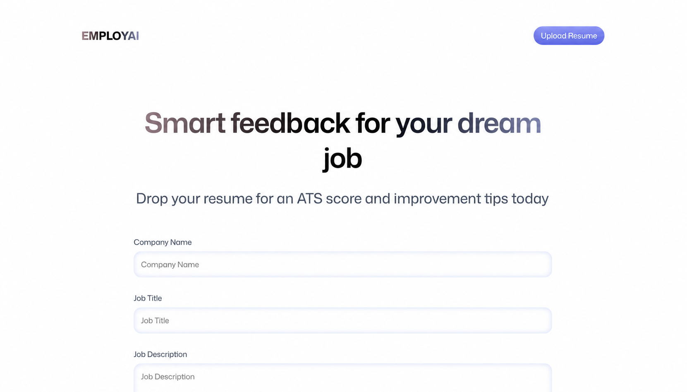

# EmployAI

EmployAI is an AI-assisted resume review and application-tracking experience. It lets job seekers upload a PDF resume, associate it with a company and role, and work toward tailored ATS feedback covering content, structure, skills, tone, and style.



> **Project status:** EmployAI is under active development. Authentication, the application dashboard, PDF validation, and uploads to Puter storage are implemented. The Puter AI and key-value integrations, feedback schema, and analysis prompt are prepared in the codebase; completing the upload-to-analysis flow and detailed feedback page is the next step.

## Features

- **Puter authentication** — sign in and out without maintaining a separate authentication backend.
- **Protected application dashboard** — unauthenticated visitors are redirected to the login experience.
- **Application overview** — responsive cards display the company, target role, resume preview, and overall score.
- **Job-aware resume intake** — capture a company name, job title, and job description for tailored feedback.
- **Drag-and-drop PDF upload** — accepts one PDF of up to 20 MB, with click-to-browse support.
- **Upload preview and removal** — shows the selected filename and human-readable file size before submission.
- **Cloud file storage** — uploads resumes through the Puter.js filesystem API.
- **AI analysis foundation** — a structured prompt and typed response model support resume analysis through Puter AI using Claude Sonnet 4.
- **Detailed scoring model** — feedback is designed around an overall score plus ATS compatibility, tone and style, content, structure, and skills.
- **Puter data services** — typed wrappers are included for AI chat, image-to-text, filesystem operations, and key-value persistence.
- **Responsive interface** — mobile-friendly layouts, score visualizations, gradients, transitions, and loading states.
- **SSR-ready production build** — React Router server rendering, optimized Vite builds, and a multi-stage Docker image.

## Technology Stack

| Area | Technology | Purpose |
| --- | --- | --- |
| UI | React 19 | Component-based user interface |
| Framework | React Router 7 | Routing, metadata, server rendering, and production serving |
| Language | TypeScript 5 | Static typing across components and service integrations |
| Build tooling | Vite 7 | Development server, HMR, and optimized builds |
| Styling | Tailwind CSS 4 | Utility-first responsive styling and custom design tokens |
| State | Zustand 5 | Puter authentication and service state |
| Authentication | Puter.js | Browser-based sign-in and user sessions |
| AI | Puter AI / Claude Sonnet 4 | Structured, job-aware resume feedback integration |
| Storage | Puter File System and KV | Resume uploads and application data primitives |
| File handling | React Dropzone | Accessible drag-and-drop PDF selection and validation |
| PDF tooling | PDF.js | PDF processing support |
| Utilities | clsx, tailwind-merge | Conditional and conflict-safe class composition |
| Deployment | Node.js 20, Docker | Reproducible production builds and hosting |

## How It Works

1. The app initializes Puter.js and checks the visitor's authentication state.
2. The user signs in and opens the resume upload form.
3. They enter the target company, role, and job description.
4. EmployAI validates the selected PDF and uploads it to Puter storage.
5. The analysis layer is designed to send the stored resume and job context to Puter AI.
6. Structured feedback can then be persisted and presented as category scores and improvement tips.

Steps 1–4 are currently wired into the interface. Steps 5–6 are represented by the service methods, prompt, and types and still need to be connected to the upload flow.

## Getting Started

### Prerequisites

- Node.js 20 or newer
- npm
- A modern browser with JavaScript enabled
- A Puter account for authentication and cloud services

No API key or local environment file is currently required. Puter.js is loaded in the browser and prompts users to authenticate when needed.

### Installation

```bash
git clone <your-repository-url>
cd EmployAI
npm install
```

### Development

```bash
npm run dev
```

Open [http://localhost:5173](http://localhost:5173).

### Quality Checks

```bash
npm run typecheck
npm run build
```

### Production

```bash
npm run build
npm run start
```

The production server uses the generated `build/server/index.js` entry point.

## Docker

Build and run the multi-stage production image:

```bash
docker build -t employai .
docker run --rm -p 3000:3000 employai
```

Then visit [http://localhost:3000](http://localhost:3000).

## Project Structure

```text
EmployAI/
├── app/
│   ├── components/       # Navbar, uploader, resume card, and score UI
│   ├── lib/puter.ts      # Typed Puter auth, AI, filesystem, and KV store
│   ├── routes/           # Home, authentication, and upload pages
│   ├── app.css           # Tailwind theme and reusable component styles
│   ├── root.tsx          # Application shell and Puter initialization
│   └── routes.ts         # Route definitions
├── constants/            # Demo resumes, AI response schema, and prompt builder
├── public/               # Static images, icons, and PDF worker assets
├── types/                # Resume, feedback, and Puter type definitions
├── Dockerfile            # Multi-stage production image
├── react-router.config.ts
└── vite.config.ts
```

## Available Scripts

| Command | Description |
| --- | --- |
| `npm run dev` | Start the development server with hot module replacement |
| `npm run typecheck` | Generate route types and run the TypeScript compiler |
| `npm run build` | Create the client and server production bundles |
| `npm run start` | Serve the production build |

## Roadmap

- Connect uploaded resumes to the AI feedback request.
- Parse and validate the structured AI response.
- Persist application records with Puter KV storage.
- Replace demo dashboard records with the signed-in user's applications.
- Add a resume detail route with category scores and actionable tips.
- Add automated tests and user-facing error states.

## Privacy Note

Resumes can contain sensitive personal information. Review Puter's data and privacy terms before uploading real documents, and avoid committing resume files or personal data to the repository.

## Contributing

Contributions are welcome. Create a focused branch, run the typecheck and production build, and open a pull request describing the behavior you changed.
